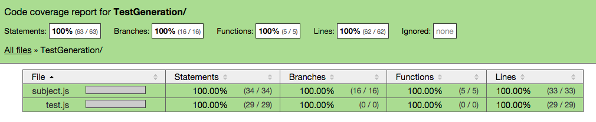

### Test Generation Result

<pre>
=============================== Coverage summary ===============================
Statements   : 100% ( 64/64 )
Branches     : 100% ( 16/16 )
Functions    : 100% ( 5/5 )
Lines        : 100% ( 63/63 )
================================================================================
</pre>

#### You can see a better visualization of the results here:
    
    open coverage/lcov-report/TestGeneration/subject.js.html
#### You will see

	

### Test Generation in Java

Download randoop:

    wget https://randoop.googlecode.com/files/randoop.1.3.4.jar

Sample execution to generate tests for all classes in the java.util.Collections namespace (Need Java 7):

    java -classpath randoop.1.3.4.jar randoop.main.Main gentests --testclass=java.util.TreeSet --testclass=java.util.Collections --timelimit=60

This will create a file `RandoopTest.java`, which contains a test driver, and `RandoopTest0.java`, which contains the generated unit tests.

### Coverage in Java

[Emma](http://emma.sourceforge.net/intro.html) is a decent option to collect coverage information form a java program.
